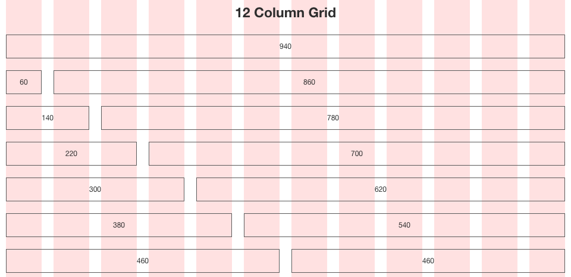

## Bootstrap 是什麼？

Bootstrap 是一個框架，簡單來說先在 \<head\> 引入 Bootstrap，

之後套用指定的 class，或者依照 Bootstrap 文件給的範例套用，就可以使元素套用 Bootstrap 底層幫你預設好的屬性，

簡單來說就是套用別人幫你做好的樣板，而這些樣板的功能與顯示效果在 Bootstrap 上的文件中都能看到圖片與對應的內容


## 請簡介網格系統以及與 RWD 的關係

- 網格系統

設計一個平面版面時，要如何規劃是沒有限制的，但相對而言就沒有一個依據來設計，如同在白紙上作畫。

為了解決這個問題，出現了網格系統，注意它並非 CSS 相關的專有名詞，而是早就實行於設計界

透過網格系統，在做版面設計的同時就會依據此標準劃分版面，就不用去思考說若我將版面一分為二為 X 或 Y 的話，X 與 Y 分別要是什麼數字

網格系統通常將版面分為 12 / 16 等分，這樣我就可以直接以 12 / 16 等分為分母調整比例就好，十分便利且有依據

如早期出現的 960 Grid System，之所以如此稱之是因為早期電腦左右寬度像素為 1024，而扣掉瀏覽器邊框與滑桿多為 960 像素，以此像素做網格，因而得稱之



960 Grid System — Demo ( 來源為 https://960.gs/demo.html )

由此也可以理解為何網格系統會分為 12 與 16 等分，

而這一部分在 CSS 也有所實現，如 grid 語法等

- RWD (Responsive Web Design) 響應式網頁設計

在手機剛出來的時代，不少了開始用手機瀏覽網頁，而且比例逐漸攀升

另外平板的市佔率也越來越高，原本因應電腦使用需求而產生的網頁，為了要符合人們在手機 / 平板上的使用需求，特設了「手機版」網頁

這的確很常見，但是對於開發人員而言，若有網站更新，勢必得一次更新電腦版網頁與手機版網頁，相當不方便

於是呼 RWD 就應運而生，「響應式」的意思在於可以根據使用者的瀏覽窗口不同而反應不同的顯示格式，

比如說當我的瀏覽器窗口寬度小於 720px，原本一列兩行的顯示方式就改為一列一行，而第二行就被擠到下一列，以免兩行擠在都看不清楚內容

瀏覽器寬度大於 720px

| A | B | C |
|---|---|---|
| D | E | F |

瀏覽器寬度小於 720px

|  A  |  B  |
| --- | --- |
|  C  |  D  |
|  E  |  F  |

再更小的話

|  A  |
| --- |
|  B  |
|  C  |
|  D  |
|  E  |
|  F  |


這部分隨著 CSS 3 的普及，在目前網站中已經有越來越多的應用，

讓同一個網站套用此設計，就可以應付各式各樣的瀏覽情形

- 網格系統與 RWD 的關係

網格系統是將網頁布局分為 x 等分，假設 x 為 12

在替網頁做 RWD 時，會直接設計 : 當瀏覽視窗 pxiel 小於多少像素時，占比直接從原本預設變為占比 y 等分

這邊可以直接套用網格系統，也就是讓 y 依據 x 做定義，比如說原本我這一列有兩行顯示為 6 : 6

應用在 RWD 就可以設定當瀏覽器窗口小於某像素時，設為一行占滿一列　( 即 12 )，而原本第二行的內容直接往下轉為第二列這樣


## 請找出任何一個與 Bootstrap 類似的 library

[Material Design Lite](https://getmdl.io/)

由 Google 所開發，致力於「擬真」風格的外觀工具箱，

( 關於「擬真」的說法是在網路上看到的，意思就是 MDL 裡面的模板似乎都有意讓元素顯示立體化 )

不過參考[這個](https://progressbar.tw/posts/32) 網站會發現 MDL 的使用上會一併引入底層的 javascript，使得客製化非常難製作，除非很熟，相對來說，Bootstrap 客製化的的門檻就低了不少。


## jQuery 是什麼？

jQuery 是一套 javascript 框架，由美國人 John Resig 於 2006 年創建，目前版本為 3.4.0

效果在於將 javascript 快速化與簡潔化，可以讓開發者更方便的處理 DOM 元素，而隨著時代的演進，jQuery 已經相容於大部分瀏覽器，這也是它的優勢之一

jQuery 簡化了不少 Javascript 語法，如

```javascript
document.queryselector('#id') // javascript

$('#id') // jQuery
```

除此之外 jQuery 也用非常簡單的語法，實現一些在 javascript 在編寫中較為繁雜的功能

```javascript
document.queryselector('#id') // javascript

$('#id').slideDown('slow') // 使 id 為 id 的元素以較慢的速度滑進窗口
```

[你不一定需要 jQuery](http://youmightnotneedjquery.com/#has_class)

上列網站是老師上課推薦的，個人也超級推

但記得重點是 jQuery 是簡潔，背後的原理還是與前幾週所學的 DOM 概念與 Javascript Selector 一樣，

也可以理解為何老師在前十二週希望我們都用原生 Javascript 來操作 DOM 元素

感謝老師的用心良苦 QQ


## jQuery 與 vanilla JS 的關係是什麼？

vanilla JS 其實就是原生 Javascript，jQuery 是基於原生 Javascript 開發出來的套件，兩者的關係大概如此

只是因為 jQuery 的市占率實在太大了 ( 超過 50% )，所以不少初學者以為它是底層的東西，其實它就只是套件而已

可以看這一篇[搞笑文](https://segmentfault.com/a/1190000000355277)

其實這一篇文的意思就是在告訴你，不論未來我們使用 jQuery 甚至是其他框架如 Vue.js

都不要忘記這些套件都是基於原生 Javascript － vanilla JS 而產生

雖然這些框架方便的 coding 的過程，但不要忘記底層仍然是依照原生 Javascript 的邏輯在運作

不過我也承認使用了 jQuery 真的會有點回不去 vanilla JS

另外就是剛從 vanilla JS 跳到 jQuery 還有點不熟，所以很多 jQuery 好用的語法都沒有用到就是了


