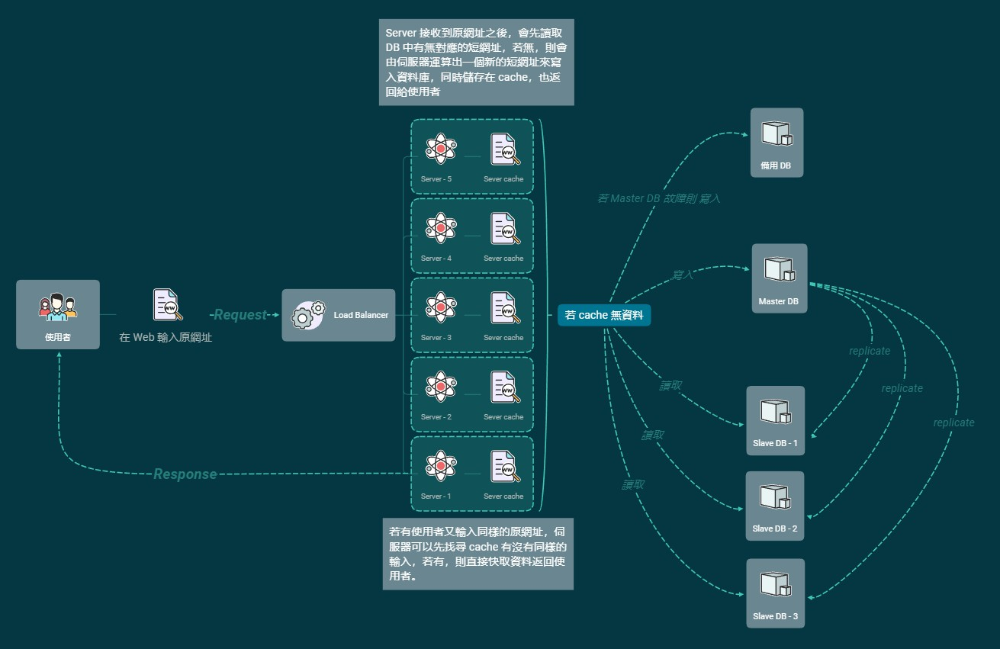

# 短網址服務系統

1. 使用者輸入原網址，按下發送
2. 伺服器端的 Load Balancer 收到 Request，經由運算之後決定讓其中一台 Server 處理
3. Server 先檢查 cache 中有無相同資料，若無，則找尋資料庫；若有，則返還 cache 中資料
4. 若資料庫也無對應資料，則寫入資料庫與 cache

簡單補充 : 

1. 存取 cache 的 Server 與接收使用者請求的 Server 不一樣，如何比對資料？

    - 使用 NFS ( Network FileSystem )

        簡單來說就是讓不同機器 / 不同作業系統彼此分享檔案

    - 網路空間 ( 如 AWS )
    
2. 不同的 Server 如何辨識同一個 User 的 Session ?

    - 在 Server 主機程式中使用叢集 ( Cluster ) 連接各伺服器，以達到「共有 Session 」

    - 自行設計 Session 機制，比如說設立一個讓所有 Server 都可以存取資料的地方

資料來源 :

[大架構的概念與程式設計系列文章](http://akuma1.pixnet.net/blog/post/168180962-%E5%A4%A7%E6%9E%B6%E6%A7%8B%E7%9A%84%E6%A6%82%E5%BF%B5%E8%88%87%E7%A8%8B%E5%BC%8F%E8%A8%AD%E8%A8%88%EF%BC%8D%EF%BC%8D%EF%BC%88%E4%B8%80%EF%BC%89%E5%B0%8E%E8%AB%96)