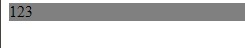
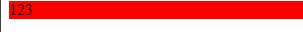
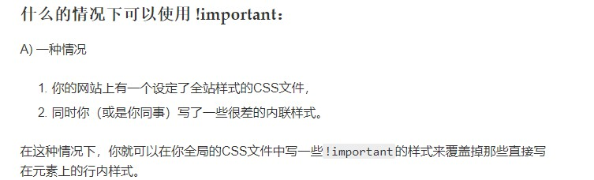

## CSS 預處理器是什麼？我們可以不用它嗎？

CSS 預處理器是一個套件，可以用「程式化」方式編撰 CSS 並加入邏輯運算功能，最後再輸出成 CSS 檔案使用。

它是一個非必要使用的套件，只是這個套件實現了眾開發者一直想實現的功能，最好的案例是可以使用變數代替屬性的值，不但可以方便編輯，也可以僅僅修改變數而改變整個頁面。

---

## 請舉出任何一個跟 HTTP Cache 有關的 Header 並說明其作用。

Cache-Control

是在 Http 1.1 新出現的 header，解決了 Expires 遇到的問題 ( 指定過期時間參照電腦本機的時間的問題 )。本身有許多用法類型，這邊介紹一下：

max-age : 中文俗稱新鮮度，簡單來說就是該 cache 可以活多久，單位為秒
no-store : 該 response 不會存下來，等於沒有 cache
private : 限制只有當下使用者可以使用該 cache，不得分享，私有的快取可以存 response 內容
public : 該 response 可以被所有 Client 做快取

[Cache-Control MDN](https://developer.mozilla.org/zh-CN/docs/Web/HTTP/Headers/Cache-Control)

從介紹上看來，Cache-Control 掌握著對 cache 大多數的設定，而且有了它其實可以不使用 Expires ( 若兩者同時存在，且 max-age 有指定，瀏覽器會自動忽略 Expires )，主要原因是因為 Cache-Control 提供了一個絕對存活時間，所以可以直接參照。

另外提一下幾個參數

max-stale : 僅用在 request，代表該 request 允許 cache 過期之後還能使用多久時間，如果不指定值，則過期多久都可以使用，可與 max-age 合用

> `Cache-Control: max-age=60*60, max-stale=60*60`

no-cache : 確認 Server 是否有更新，若無則回傳 304 Status Code，有則發送新 request

---

## Stack 跟 Queue 的差別是什麼？

- 論處理順序的差別

    Stack 是優先進入的最後處理，可以想像成是疊餐盤，最後放上去的先用
    Queue 優先進入的則優先處理，可以想像成排隊，先到的先點，也就是照進入順序處理

- 論運作時的差別

    JavaScript 是單執行緒且非同步程式語言，當處理非同步函式呼叫時，會同時運用到 Stack(Call Stack) 與 Queue

    另外介紹 Event Loop，它就像是兩者之間不斷旋轉的檢測器，輪流指向兩者，以檢測「若 Call Stack 為空，則 Queue 內的事件將按順序轉移到 Call Stack」，再處理 Call Stack 內的事件

    下列這個例子可以理解兩者在處理 Callback function 時所扮演的角色與工作流程

    ```JavaScript
    console.log('Hello!')

    setTimeout(function(){
        console.log('Hi! Callback!')
    }, 3000)

    console.log('Bye!')
    ```
    在這個案例中，Call Stack 中先執行了 `console.log('Hello!')`，然後執行 `setTimeout`，從這個例子可以預測它會等 3 秒才會執行 `console.log('Hi! Callback!')`，所以在這邊會如此處理：

    > 要記住的是 `setTimeout` 並非 JavaScript 提供的函式，而是瀏覽器所提供的 API
    
    在 Call Stack 當下會執行，內中的 Callback function 會被轉移到「Web API」之中，然後 `setTimeout` 在 Call Stack 中結束。

    之後 Call Stack 中執行 `console.log('Bye!')`，並從中結束它

    這時候 Call Stack 已經空了，計時器時間也到了，原本在 Web API 計時的 Callback function 會被轉移到 **Queue**，這時候由於前述 Event loop 檢測到 Call Stack 為空，所以將 Callback function 從 Queue 移入 Call Stack 執行 `console.log('Hi! Callback!')` 並結束之

---

## 請去查詢資料並解釋 CSS Selector 的權重是如何計算的（不要複製貼上，請自己思考過一遍再自己寫出來）


**在選擇器相同的前提下**，下面的會覆蓋掉上面的，可以理解成新的蓋住舊的

```css
div {
    background-color: gray;
}
div {
    background-color: black;
}
```
div 顯示背景為黑色

---

但當利用 class 屬性作選擇時，以 id 選擇器為優先

```html
<body>
    <div id="main" class="block">
        123
    </div>
</body>
```
```css
.block {
    background-color: gray;
}
div {
    background-color: black;
}
```
div 顯示背景為灰色

---

利用 id 屬性作選擇時，以 id 選擇器為優先，也就是 id > class > 標籤 

```html
<body>
    <div id="main" class="block">
        123
    </div>
</body>
```
```css
#main {
    background-color: red;
}

.block {
    background-color: gray;
}

div {
    background-color: black;
}
```
div 顯示背景為紅色

---
然而，在 .css 檔案中的 Selector 選擇器權重，是無法大於直接在 html 標籤中直接使用 `style` 元素的

```html
<body>
    <div id="main" class="block" style="background-color:yellow">
        123
    </div>
</body>
```
```css
#main {
    background-color: red;
}
```
div 顯示背景為黃色

---

承上，除非我們在語法中使用 `!important`

```html
<body>
    <div id="main" class="block" style="background-color:yellow">
        123
    </div>
</body>
```
```css
#main {
    background-color: red！important;
}
```
div 顯示背景為紅色

---

但這邊我們來談看看一些特殊情況

- Selector 聲明次數的影響

    前面有說到，同樣的 specificity 之下，最後聲明的選擇器內容會生效，那麼在同級選擇器之下，重複聲明會改變這個結果嗎？

    ```html
    <body>
        <div id="main" class="block">
            123
        </div>
    </body>
    ```
    ```css
    .block.block {
        background-color: gray;
    }
    .block {
        background-color: black;
    }
    ```
    

    結果是灰色，這邊我們可以知道**在相同級別之下，聲明次數多者為勝**

    其實可以印證在 Week6 老師所說的，在選擇器的聲明是「越詳細的越贏」，繼續嘗試下個例子

    這個例子我們想試試看重複聲明能否影響選擇器階級，所以我重複聲明 .block 一百次對比單個 #main 看看

    ```html
    <body>
        <div class="blocks">
            <div id="main" class="block">
                123
            </div>
        </div>
    </body>
    ```
    ```css
    .blocks.block.blocks.block.blocks.block.blocks.block.blocks.block.blocks.block.blocks.block.blocks.block.blocks.block.blocks.block.blocks.block.blocks.block.blocks.block.blocks.block.blocks.block.blocks.block.blocks.block.blocks.block.blocks.block.blocks.block.blocks.block.blocks.block.blocks.block.blocks.block.blocks.block.blocks.block.blocks.block.blocks.block.blocks.block.blocks.block.blocks.block.blocks.block.blocks.block.blocks.block.blocks.block.blocks.block.blocks.block.blocks.block.blocks.block.blocks.block.blocks.block.blocks.block.blocks.block.blocks.block.blocks.block.blocks.block.blocks.block.blocks.block.blocks.block.blocks.block {
        background-color: gray;
    }
    #main {
        background-color: red;
    }
    ```
    實際測試之後發現

    

    是紅色，那麼我們聲明一千次看看

    ```css
    .blocks.block.blocks.block.blocks.block.blocks.block.blocks.block.blocks.block.blocks.block.blocks.block.blocks.block.blocks.block.blocks.block.blocks.block.blocks.block.blocks.block.blocks.block.blocks.block.blocks.block.blocks.block.blocks.block.blocks.block.blocks.block.blocks.block.blocks.block.blocks.block.blocks.block.blocks.block.blocks.block.blocks.block.blocks.block.blocks.block.blocks.block.blocks.block.blocks.block.blocks.block.blocks.block.blocks.block.blocks.block.blocks.block.blocks.block.blocks.block.blocks.block.blocks.block.blocks.block.blocks.block.blocks.block.blocks.block.blocks.block.blocks.block.blocks.block.blocks.block.blocks.block.blocks.block.blocks.block.blocks.block.blocks.block.blocks.block.blocks.block.blocks.block.blocks.block.blocks.block.blocks.block.blocks.block.blocks.block.blocks.block.blocks.block.blocks.block.blocks.block.blocks.block.blocks.block.blocks.block.blocks.block.blocks.block.blocks.block.blocks.block.blocks.block.blocks.block.blocks.block.blocks.block.blocks.block.blocks.block.blocks.block.blocks.block.blocks.block.blocks.block.blocks.block.blocks.block.blocks.block.blocks.block.blocks.block.blocks.block.blocks.block.blocks.block.blocks.block.blocks.block.blocks.block.blocks.block.blocks.block.blocks.block.blocks.block.blocks.block.blocks.block.blocks.block.blocks.block.blocks.block.blocks.block.blocks.block.blocks.block.blocks.block.blocks.block.blocks.block.blocks.block.blocks.block.blocks.block.blocks.block.blocks.block.blocks.block.blocks.block.blocks.block.blocks.block.blocks.block.blocks.block.blocks.block.blocks.block.blocks.block.blocks.block.blocks.block.blocks.block.blocks.block.blocks.block.blocks.block.blocks.block.blocks.block.blocks.block.blocks.block.blocks.block.blocks.block.blocks.block.blocks.block.blocks.block.blocks.block.blocks.block.blocks.block.blocks.block.blocks.block.blocks.block.blocks.block.blocks.block.blocks.block.blocks.block.blocks.block.blocks.block.blocks.block.blocks.block.blocks.block.blocks.block.blocks.block.blocks.block.blocks.block.blocks.block.blocks.block.blocks.block.blocks.block.blocks.block.blocks.block.blocks.block.blocks.block.blocks.block.blocks.block.blocks.block.blocks.block.blocks.block.blocks.block.blocks.block.blocks.block.blocks.block.blocks.block.blocks.block.blocks.block.blocks.block.blocks.block.blocks.block.blocks.block.blocks.block.blocks.block.blocks.block.blocks.block.blocks.block.blocks.block.blocks.block.blocks.block.blocks.block.blocks.block.blocks.block.blocks.block.blocks.block.blocks.block.blocks.block.blocks.block.blocks.block.blocks.block.blocks.block.blocks.block.blocks.block.blocks.block.blocks.block.blocks.block.blocks.block.blocks.block.blocks.block.blocks.block.blocks.block.blocks.block.blocks.block.blocks.block.blocks.block.blocks.block.blocks.block.blocks.block.blocks.block.blocks.block.blocks.block.blocks.block.blocks.block.blocks.block.blocks.block.blocks.block.blocks.block.blocks.block.blocks.block.blocks.block.blocks.block.blocks.block.blocks.block.blocks.block.blocks.block.blocks.block.blocks.block.blocks.block.blocks.block.blocks.block.blocks.block.blocks.block.blocks.block.blocks.block.blocks.block.blocks.block.blocks.block.blocks.block.blocks.block.blocks.block.blocks.block.blocks.block.blocks.block.blocks.block.blocks.block.blocks.block.blocks.block.blocks.block.blocks.block.blocks.block.blocks.block.blocks.block.blocks.block.blocks.block.blocks.block.blocks.block.blocks.block.blocks.block.blocks.block.blocks.block.blocks.block.blocks.block.blocks.block.blocks.block.blocks.block.blocks.block.blocks.block.blocks.block.blocks.block.blocks.block.blocks.block.blocks.block.blocks.block.blocks.block.blocks.block.blocks.block.blocks.block.blocks.block.blocks.block.blocks.block.blocks.block.blocks.block.blocks.block.blocks.block.blocks.block.blocks.block.blocks.block.blocks.block.blocks.block.blocks.block.blocks.block.blocks.block.blocks.block.blocks.block.blocks.block.blocks.block.blocks.block.blocks.block.blocks.block.blocks.block.blocks.block.blocks.block.blocks.block.blocks.block.blocks.block.blocks.block.blocks.block.blocks.block.blocks.block.blocks.block.blocks.block.blocks.block.blocks.block.blocks.block.blocks.block.blocks.block.blocks.block.blocks.block.blocks.block.blocks.block.blocks.block.blocks.block.blocks.block.blocks.block.blocks.block.blocks.block.blocks.block.blocks.block.blocks.block.blocks.block.blocks.block.blocks.block.blocks.block.blocks.block.blocks.block.blocks.block.blocks.block.blocks.block.blocks.block.blocks.block.blocks.block.blocks.block.blocks.block.blocks.block.blocks.block.blocks.block.blocks.block.blocks.block.blocks.block.blocks.block.blocks.block.blocks.block.blocks.block.blocks.block.blocks.block.blocks.block.blocks.block.blocks.block.blocks.block.blocks.block.blocks.block.blocks.block.blocks.block.blocks.block.blocks.block.blocks.block.blocks.block.blocks.block.blocks.block.blocks.block.blocks.block.blocks.block.blocks.block.blocks.block.blocks.block.blocks.block.blocks.block.blocks.block.blocks.block.blocks.block.blocks.block.blocks.block.blocks.block.blocks.block.blocks.block.blocks.block.blocks.block.blocks.block.blocks.block.blocks.block.blocks.block.blocks.block.blocks.block.blocks.block.blocks.block.blocks.block.blocks.block.blocks.block.blocks.block.blocks.block.blocks.block.blocks.block.blocks.block.blocks.block.blocks.block.blocks.block.blocks.block.blocks.block.blocks.block.blocks.block.blocks.block.blocks.block.blocks.block.blocks.block.blocks.block.blocks.block.blocks.block.blocks.block.blocks.block.blocks.block.blocks.block.blocks.block.blocks.block.blocks.block.blocks.block.blocks.block.blocks.block.blocks.block.blocks.block.blocks.block.blocks.block.blocks.block.blocks.block.blocks.block.blocks.block.blocks.block.blocks.block.blocks.block.blocks.block.blocks.block.blocks.block.blocks.block.blocks.block.blocks.block.blocks.block.blocks.block.blocks.block.blocks.block.blocks.block.blocks.block.blocks.block.blocks.block.blocks.block.blocks.block.blocks.block.blocks.block.blocks.block.blocks.block.blocks.block.blocks.block.blocks.block.blocks.block.blocks.block.blocks.block.blocks.block.blocks.block.blocks.block.blocks.block.blocks.block.blocks.block.blocks.block.blocks.block.blocks.block.blocks.block.blocks.block.blocks.block.blocks.block.blocks.block.blocks.block.blocks.block.blocks.block.blocks.block.blocks.block.blocks.block.blocks.block.blocks.block.blocks.block.blocks.block.blocks.block.blocks.block {
        background-color: gray;
    }
    #main {
        background-color: red;
    }
    ```
    來看看結果
    
    

    還是紅色

    在正常的情況下，我們不可能會有聲明一千次的情況，所以可以先簡單下一個結論：

    > 優先級必定大於聲明次數

    這也可以印證老師在 Week6 所講解的權重計算方式，若把宣告一千次 class selector 的當作選手 A，單次 id selector 當作選手 B，有以下計算方式：

    |選手|!important|inline|id|class|element|
    |:----:|:----:|:----:|:----:|:----:|:----:|
    |A| 0 | 0 | 0 | 1000 | 0 |
    |B|0 | 0 | 1 | 0 | 0 |

    從左比到右，在 id 欄，選手 B 為 1，選手 A 為 0，`1 > 0`，B 勝，齁勝

    ---

    再回到正常一點的例子

    ```css
    /* 選手 A */
    div.class {
        background-color: red;
    }

    /* 選手 B */
    .class {
        background-color: black;
    }
    ```
    兩個看起都是在選擇 .class，所以結果會是黑色嗎?

    

    結果是紅色

    這邊就要用剛剛的表格，在這種情況下，需要將 selector 拆開來看，選手 A 有一個 class selector，選手 B 也有，這邊平手，要**往下一階層比**，選手 A 有一個 type selector，選手 B 有 0 個，所以選手 A 勝

    |選手|!important|inline|id|class|element|
    |:----:|:----:|:----:|:----:|:----:|:----:|
    |A| 0 | 0 | 0 | 1 | 1 |
    |B|0 | 0 | 0 | 1 | 0 |

    這就是當**最高優先級**聲明次數相同時的比較方法。當然，若比較到最後各階層的聲明數量都一樣，那最後聲明者為勝

---

說了這麼多，我們對優先級做一個結論：

在最開頭，選擇 div 的方法稱為 type selectors，它的優先級是最低的，與偽元素 (pseudo-elements) 相同

再者是我們最常使用的 class selectors，與之同級的還有**屬性選擇器**和 **pseudo-classes** ( 如:hover )

**屬性選擇器**是因為這次作業才特地去了解的，見範例

```html
<div height="80px">123</div>
```
```css
div[height] {
    background-color: red;
}
```
也就是

> element[attribute] { ... }

承上，你也可以這樣寫
```css
div[height="80px"] {
    background-color: red;
}
```
也就是

> element[attribute=val] { ... }

其餘關於屬性選擇器補充可參考[這篇](http://notepad.yehyeh.net/Content/WebDesign/CSS/selector/2.php)

比  type selectors 與 class selectors 更高級者就是 id selectors，這邊就不贅述

上述三者可以視為一群，原因是因為它們都是我們在 .css 常用的 selector，但它們的優先級都比不上**在 html 頁面中直接在標籤中定義 style 元素**

所以也可以理解為何在 html 頁面編寫 css 造成難以維護的原因，權重是很重要的一個影響因素

最後，比前四者更大的，就是 !important，可以視為黑暗大法師，出了就贏了

這邊上一下 MDN 關於它的解說，有寫到技術上 !important 與優先級無關，但實際上還是可以照上述規則來套用，嗯，看不懂

不過在何時該使用 !important 的時機 MDN 給了很有趣的答案：



官方認證的同事坑....

