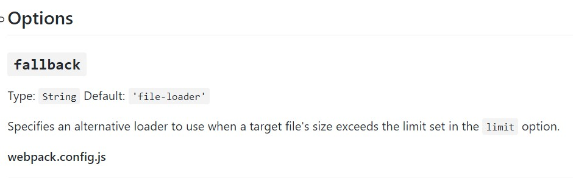
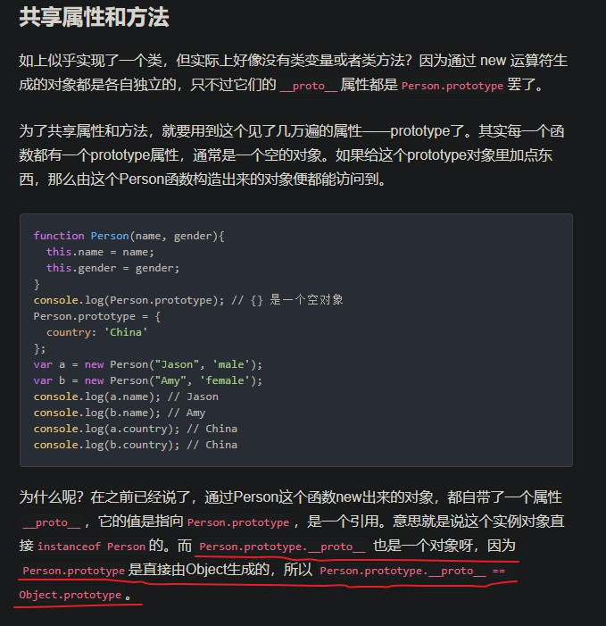

# 前言

由於這週所教的部分筆記有做起來，所以實際上的心得筆記可以回看之前的就好

這週想針對這個月 ( Week16 - Week19 ) 有興趣的點做一些補充，

會這樣做的原因是因為，第十六與十八週都是教工具應用，第十七週教 JavaScript 底層運作與程式機制，第十九週談網頁架構

所以本週複習週不會以週區分，而是以主題區分，挑自己想複習的重點，Webpack 一區，JavaScript 運作一區

心得筆記由於已經有撰寫，這邊就不再重寫了

# Webpack

## 所以 Webpack 到底是什麼 ? 它與 Gulp 又有什麼區別 ?

當我們把這個問題提出來的時候，基本上這個問題本身就很有問題了

在問這個問題之前，必須先下一個前提，那就是：在 XXX 功能上，Webpack 與 Gulp 有什麼區別 ?

假設我今天的前提，是要讓 Scss 自動轉成 css，那兩者的功能可以說是毫無區別

但假設今天我的問題的前提是，兩者將 Scss 轉成 css 的 Work flow 是否一樣 ? 那答案就是有所差別

所以我認為這一個問題，其實不能算是問題，因為就實務上來說，你沒有必要擇一，你可以都使用

於是乎我們來談談實務上 Webpack 到底能為我們做什麼，至少，就目前我們所學而言，它能怎麼做？

## webpack.config.js

其實 webpack 就是一個打包工具，目的是打包，其餘套件僅僅是附帶的功能，所以如果談套件，那其實 gulp 也可以做到一樣的事情

但打包引入這個功能是 gulp 無法做到的，`export { }` 與 `import { }` 的運行環境是僅在 node.js 才被允許，這點可不能忘記

(是說 Chrome 現在已經可以支援了的樣子)

但通過 webpack 「打包」之後，我們就可以讓瀏覽器裡的 JavaScript 做到這個功能

現在讓我們來了解 webpack.config.js 的構造

```javascript
const path = require('path');
const webpack = require('webpack');

module.exports = {
  entry: './src/index.js', // 引入要編譯的 code
  output: {
    // 輸出的位置，__dirname 所指為 webpack.config.js 所在位置
    path: path.resolve(__dirname, 'dist'),
    filename: 'index.bundle.js' // 打包完成品
  },
  module: {
    rules: [   // 一個 Array, 編譯這份 code 的順序
      {
        test: /\.css$/,
        loaders: ["style-loader","css-loader"]
      },
      {
        test: /\.(jpe?g|png|gif)$/i,
        loader:"file-loader",
        options:{
          name:'[name].[ext]',
          outputPath:'assets/images/'
          //the images will be emited to dist/assets/images/ folder
        }
      },
      {
        test: /\.s[ac]ss$/i, // 一種 regex (正規表達式)，用來比對檔名，也可寫 /\.(scss|sass)$/
        use: [
          // Creates `style` nodes from JS strings
          'style-loader',
          // Translates CSS into CommonJS
          'css-loader',
          // Compiles Sass to CSS
          'sass-loader',
        ],  
        // 總結，只要是 sass/scss 的副檔名，都要經過　use: [ ] 內的 loader 處理，處理順序是由最尾至前頭
      },
    ],
  },
  resolve: {
    alias: {
      //
      jquery:  'jquery/dist/jquery.min.js',
      "jquery-ui": "jquery-ui/jquery-ui.js",  
      'jquery-ui': path.resolve('./node_modules/jquery-ui/ui'),      
      // bind to modules;
      modules: path.join(__dirname, "node_modules"),
    }
  },
  plugins: [
    new webpack.ProvidePlugin({
      $: "jquery",
      jQuery: "jquery",
      jquery: "jquery",
      "window.jQuery": "jquery",
      "window.$": "jquery"
    })
  ]
};
```
- 參考文章 : https://ithelp.ithome.com.tw/articles/10194056

## loader 與　plugins 的差別 ?

兩者的差別在於，loader 用於轉化檔案，使 webpack 打包過程中添加原本不附帶的能力 (講是這樣講，但其實一些 loader 的功能- 如 babel 的編譯與 mibify-JS 的壓縮都內建在 webpack 4.0 之中了)

另外，loader 的執行順序是**由下至上** (由右至左)

而就**時點**來講，loader 是在 webpack 執行編譯時一併執行

而 plugin 則是在 webpack **編譯前**或**編譯後**執行

若從對象而言，loader 針對的是 test 指定的檔案

而 plugins 是針對「整個 webpack 架構」做監聽，若有符合的狀況則執行該操作

可以理解成

```
plugins => webpack(loader)

或是

webpack(loader) => plugins
```

- 參考文章 :

  - https://blog.csdn.net/qq_34629352/article/details/83628917
  - https://blog.csdn.net/keliyxyz/article/details/51579078

## 如何理解 loader ?

loader 就是設定 webpack 該「怎麼處理」引入的檔案，這邊的檔案不限於 .js，也可以是 sass/scss/css 等

而 webpack chain 的概念其實看起來跟 gulp 的處理流程有點像，你也可以理解成 curl 的 pipe 概念，也就是將前一個處理的輸出當作後一個處理的輸入。

## module 下 test 的寫法與 loader 

- test

  test 的正規表達式要怎麼表達呢 ?

  如果要搜尋所有 .js 檔名，則是 `/\.js$/`

  如果要搜尋所有 .js 或 .jsx，則是 `/\.jsx?$/`

  而你也可以看看下列範例中的 `/\.s[ac]ss$/`，由 `[ ]` 包住的每個字母都可以視作內容，如 `[ac]` 可以代表 `[a]` 或 `[c]`，所以可以看做 sass / scss 都可以

- loader

  在 run webpack 時，test 通過就會來檢驗 loader 的部分，名稱用 use 或 loader 的方式並不同

  loader 搭配 `""` 與 `!` :

  ```javascript
    test: /\.s[ac]ss$/,
    loader: "style!css!sass" // loader 改成 use 也可以
  ```

  use 就是個陣列表達方式，比較推薦，好讀：

  ```javascript
    test: /\.s[ac]ss$/,
    use: ["style-loader" , "css-loader" , "sass-loader"] // 感覺比較好讀
  ```
  這樣寫也是可以

  ```javascript
    test: /\.s[ac]ss$/,
    loader: ["style" , "css" , "sass"] // 感覺比較好讀
  ```

  記住上列處理的順序是 sass-loader -> css-loader -> style-loader

  這邊講一下為什麼 sass-loader 後面還要接 css-loader 和 style-loader

  事實上 css-loader 是我們要編譯 .css 檔案的標配，而 style-loader 則是要用來實現引入 .css 檔案的 .js 檔案可以順利被 HTML 用 `<script>` 引入

  所以光是我們要引入 .css 檔案就會需要 css-loader 與 style-loader

  那麼 sass-loader 就只是更多了一步 - 將 .scss / .sass 檔案轉換為 .css 檔

  這邊也可以比較好理解 ass-loader -> css-loader -> style-loader 的順序排列

- 補充 : 目前安裝 sass-loader 時應該連 node-sass 也一起安裝

## 來介紹一個壓縮圖片的 loader

`file-loader` 與 `url-loader`

在第十八週我們學過 Data URL 與 CSS Spirits，現在我們來討論前者，webpack 有一個 loader 可以幫我們設定當圖片檔案大小於多少範圍時，可以自動將其轉成 base64，那就是 `url-loader`

而 `file-loader` 則是 webpack 引入檔案用的，而很多小圖就不要用 `file-loader` 來處理，交給 `url-loader` 來轉成 DataURL，，如果是大圖，我們就老老實實發送 Request 去取

總之先來看看 `url-loader` 的官方說明文件 :

> url-loader works like `file-loader`, but can return a DataURL if the file is smaller than a byte limit.

這邊說明 `url-loader` 是類似於 `file-loader` 的工作方式．對於小於一定大小的檔案，將其轉為 DataURL



`url-loader`有一個 `fallback` 參數，意思是說「當圖片超過 limit 設定的限制大小時」就使用 `file-loader`，所以我們不用另外設定 file-loader，**但是還是要安裝**

> **也就是說，當圖片大小不大的時候，轉為 DataURL，而超過設定大小時則使用 file-loader 進行處理**

而同樣的，由於預設值包含 `file-loader`，所以在其 `options` 加入 `file-loader` 相關參數也是沒問題的

但要記住一點，由於 url-loader 的輸出不是參數
，所以不會有指定檔名格式的設定值。

[url-loader GitHub](https://github.com/webpack-contrib/url-loader)

[url-loader](https://www.webpackjs.com/loaders/url-loader/)

## 參數相關

- options

  看完上面這個壓縮圖片的套件案例之後，我們學到了 `options` 這個設定，use 底下的每一個 loader 都有自己的 `options` 可以設定

  ```javascript
  {
    test: /\.(svg|png)$/,
    use: [
      {
        loader: 'file-loader',
        options: {
          emitFile: false,
          // 不複製檔案到 ./dist
          name: '[name]-[hash].[ext]'
          // 產生 hash 之後的檔名
        }
      },
      {
        loader: 'url-loader',
        options: {limit: 40000}
      }
    ]
  }
  ```

  假若你不想在 `options` 設定，你也可以設定在 loader 之中，不使用 `options` 範例是：

  ```javascript
  {
    test: /\.(svg|png)$/,
    use: [
      {
        loader: 'file-loader?emitfile=false',
      }
    ]
  }
  ```

  不過感覺 `options` 比較易讀就是了

- include / exclude

  也是一個正規表達式，用 `/.../` 包裝

  ```javascript
  rules: [
      {
          test: /\.s[ac]ss?$/,
          loader: 'style-loader!css-loader!sass-loader',
          exclude: /node_modules/,
      }
  ]
  ```

  exclude 的意思是「排除」，上述例子就是我要排除掉 node_modules 這個資料夾

  若是 include，則是「只」處理該資料夾的檔案

# Plugin 

不同的 Plugin 插件會有不同的配置方法，所以我們直接挑 [Babel 外掛](https://webpack.docschina.org/plugins/babel-minify-webpack-plugin)來談

```javascript
// webpack.config.js
const MinifyPlugin = require("babel-minify-webpack-plugin"); // 引入 plugin
module.exports = {
  entry: //...,
  output: //...,
  plugins: [
    new MinifyPlugin(minifyOpts, pluginOpts) // new 一波
  ]
}
```

可以看到基本用法，基本上就是

- 安裝 plugin (視套件而定)
- 於 webpack.config.js 引入 plugin
- 於 webpack.config.js 的 plugins: [ ] 之中 new 一個實例，可以帶入參數

如果你點入上述的連結看，也可以看到為何我們明明已經有 babel-loader，卻還要使用 Babel plugin

> - webpack loader 对单个文件进行操作，并且 minify preset 作为一个 webpack loader将会把每个文件视为在浏览器全局范围内直接执行（默认情况下），并且不会优化顶级作用域内的某些内容。要在文件的顶级作用域内进行优化，请在 minifyOptions 中设置 mangle: { topLevel: true }。

這個說法也印證了我們稍早的時候說明 Loader 只對單個文件做操作。

關於 Plugins 的基本操作都差不多，但好處是這些外掛的開發者都會詳細寫出如何使用，比如說這個 [Speed-Measure-Plugin
](https://github.com/stephencookdev/speed-measure-webpack-plugin)，它的使用方法就和 Babel plugin 不太一樣，因為處理流程和功能的不同的差異，每個套件都不同

所以其實重點在於你看不看得懂該 Plugin 的文件而已

[Webpack 面試集合](https://blog.csdn.net/weixin_38516688/article/details/86537567)
[官方文件關於 Plugin](https://webpack.docschina.org/plugins)
[TYSON 大大關於 Webpack 鐵人賽文章](https://ithelp.ithome.com.tw/articles/10201485)

# 初探 webpack-dev server 

在**開發**的過程中，webpack --watch 指令可以讓我們在編輯引入檔案 / webpack.config.js 之後，直接重整瀏覽器就可以看到變化後的結果，但若我們連重新整理都不想按，只要修改檔案就可以即時更新瀏覽器的頁面，能做得到嗎？

可以，這個東西就叫 webpack-dev-server，是一個 node.js Express server，可以想像是利用監聽器監聽開發檔案是否有被修改，若有，就自動將瀏覽器重整

安裝：

```
npm install webpack-dev-server -D
```

安裝完之後，我們要來講一下 webpack-dev-server 的執行原理

在原本的 webpack --watch 的方法中，我們是直接開啟 html 檔案，而 html 檔案裡面是一行 `<script src="./dist/index.bundle.js></script>`

但是 webpack-dev-server 的運作卻不是這樣，我們並不是直接開啟 html 檔案，而是使用以下網址：

```
localhost:8080/webpack-dev-server
```

而這個該網址 html 所引入的 .js 位置，並不是你實體資料夾的 `/dist/index.bundle.js`，而是  webpack-dev-server 自動編譯 `index.js`，並於編譯完成之後，複製一份到記憶體之中，讓 webpack-dev-server 的 html 引用

也就是說，webpack 與 webpack-dev-server 是兩個不同的分支

```
一般流程 :
index.js 被修改 => 執行 webpack => index.bundle.js => index.html 使用

使用 webpack-dev-server
index.js 被修改 => 重新編譯 index.js => 複製一份到記憶體 => webpack-dev-server 使用
```

其實不用想得太複雜，你就想像執行 webpack 與執行 webpack-dev-server 是兩件毫不相干的事情

只是執行 webpack-dev-server 會 clone 一份一模一樣的資料夾在記憶體裡面，先簡稱原本的專案資料夾為「原資料夾」，執行 webpack-dev-server　的是「副資料夾」

*簡稱有點怪怪的，請見諒*

所以實際產品上線，你還是要執行 webpack，讓原資料夾的 index.bundle.js 產出

正因為原資料夾與副資料夾兩者是不同的，所以 html 不是去讀原資料夾 /dist 內的檔案。那我們怎樣讓 html 與去讀副資料夾內的 js 呢 ?

如果說原資料夾有關於自己的 webpack setting，那麼副資料夾也有，現在來編寫關於 webpack-dev-server 的設定檔

打開原資料夾的 webpack.config.js，在 module.exports 底下加入 devServer 設定檔

```javascript
module.exports = {
  // dev-server 的設定
  devServer: {
    contentBase: path.join(__dirname, '/'),   // 1. dev-server 的根目錄位置，關係到 html 的引入
    compress: true,                           // 2. 是否壓縮 (gzip)
    port: 8080,                               // 3. port 位置
    inline: true                              // 4. 即 inline-mode，另外還有 iframe-mode
  },
  entry: {
    app: ["./src/index.js"],
  },
  output: {
    path: path.resolve(__dirname, 'dist'),
    filename: 'index.bundle.js',
    publicPath: 'dist',             // 5. 讓 webpack-dev-server 去讀這個 path
  },
```

關於 1 點特別說明，其實就是 webpack-dev-server 的開始執行之後，副資料夾預設的位置，假設此路徑設定是 /test，那你的 index.html 就要放在 test ，`localhost:8080/webpack-dev-server` 才讀得到

而第 5 點是什麼意思呢 ? 前面有說過 webpack-dev-server 並不是真去拿原資料夾 ./dist 的 index.bundle.js，所以這邊回到稍早的問題，要讓副資料夾與底下的 html 與 index.bundle.js 掛勾在一起，就需要在 publicPath 做目錄設定

**publishPath 所設定的路徑可以給 webpack-dev-server 的 index.html 做引入參考**，所以原本 index.html 的 `<script src="./dist/index.bundle.js></script>` 並不需要修改，pathicPath 的路徑概念，你可以想像是在**div-server 執行後， 輸出至記憶體中副資料夾內的 dist 資料夾**

但是你必須重新提醒自己的是，執行 webpack-dev-server 並非真的打包，所以你原資料夾上的 /dist 底下還是不會有任何變動，這也是先前說過最後你仍需要執行 webpack 打包的原因，因為其不像 webpack --watch 是真的打包

最後，我們就可以執行 webpack-dev-server :

```
webpack-dev-server
```

記得設定至 package.json 的 script 中，省點時間打字囉！

下列參考網址還有更多關於 webpack-dev-server 的開發方法，可以參考

https://skychang.github.io/2015/08/27/Webpack-dev_server/
https://segmentfault.com/a/1190000005614604


# JavaScript 底層複習

# 前言

在 Week17 的 JavaScript 的底層運作中，我們用 Execution Context 解釋了幾乎所有在 JS 中的現象，如提升、閉包與原型鍊等。

關於 Hoisting，由於 EC 的運作方式幾乎已經很好地解釋了提升的發生，另外要多記住函式提升優先權與 TDZ，所以就不重複贅述了

這邊再更進一步，用自己習慣且更容易定義的判斷方法來看看閉包 (Closure)、`this` 與原型鍊

# Closure

- JavaScript 使用靜態作用域

    這是一個重要的概念，在 JavaScript 裡，該函式內的作用域及內中存取的變數判定都是由「該函式宣告的位置」去決定，也就是靜態作用域。

    反之則是動態作用域，非常接近 JavaScript 中 `this` 的概念

- 閉包的條件

    以我目前的觀察來看，經典例子就是：

    > 在一個函式中宣告並 `return` 該函式，且該函式存取非自己範疇的值，那麼該函式的作用域就會是一個閉包，保留值

    而需要這麼做的經典原因則是：

    > 我需要一個變數供全域存取，但我又不希望它是個全域變數

    所以閉包的定義就是：

    > 一個函式，可以把存取的值關在裡面保存現狀

- 更進一步來說 :

    在**[所有的函式都是閉包](https://github.com/aszx87410/blog/issues/35)**一文中表示，理論上 JavaScript 內的所有函式都是閉包，因為每一個函式在宣告時，都會產生該函式的 [[Scope]]

    而若就實務上定義則是：

    > 有用到「自由變數」，且離開被宣告的範疇仍被繼續使用的函式，就是閉包

    - 自由變數 :

        在函式中所存取，不為該函式中宣告且非該函式參數的變數，稱自由變數，如下列 `test` 中的 `a`

        ```javascript
        a = 10
        function test(){
            console.log(a)
        }

        test()
        ```
    而「離開被宣告的範疇仍被繼續使用的函式」，return 該函式給一個全域變數就是一個很好的例子

    比如說經典案例 `for(var i = 0..`，就是因為在迴圈中宣告了函式，且該函式存取了自由變數 `i`，並且在回呼時執行，因此存取了當時 `i` 的值

    - [[Scope]]

        宣告函數時產生，[[Scope]] 會是宣告函式的範疇 EC 的 VO，嘗試使用底層運作機制解釋閉包時，必要牢記此定義

# 複習　JavaScript 中的物件導向

要談 JavaScript 的物件導向，就先來看在 ES5 中是如何用 function 來實現的

事實上在 ES5 中，我們是宣告一個函式，並且在該函式中回傳一個物件，物件內放函式

然後使用物件導向的宣告方法：

```javascript
function Dog(name) {
    var Myname = name
    return {
        getName: function() {
            return myName
        },
        sayHello: function() {
            console.log(myName)
        }
    }
}

var d = Dog('Clay')
d.sayHello() // Clay

var e = Dog('Andy')
e.sayHello() // Andy
```

你可以理解為什麼是 d.sayHello，因為 `obj.name` 這個格式是我們一般去使用物件內屬性的用法，既然這個屬性是函式，那當然是 `obj.name()` 囉！

這樣的寫法當然不是最好的，因為 d 與 e 中的函式並不是在同一個記憶體位置，所以這樣會比較吃效能

於是有了 `new`

- `new` 

先來看看下列程式碼

```javascript
function Dog(name) {
    this.name = name
}

Dog.prototype.getName = function() {
    return this.name
}

Dog.prototype.sayHello = function() {
    console.log(this.name)
}

var d = new Dog('Clay')
d.sayHello() // Clay
var e = new Dog('Andy')
e.sayHello() // Andy

console.log(d.sayHello === e.sayHello) // true

```

我們都知道 new 一個物件是要按照設計圖創造一個新物件出來，然後我就可以去呼叫物件內的函式

那如果沒有了 new 該怎麼做 ? 這邊將會從目的來解析

也就是說，我**要宣告一個函式，使其也可以使用另一個函式的內的函式**

- Step 1. 宣告函式，並在內中宣告一個空物件

    ```javascript
    function Dog(name) {
        this.name = name
    }

    Dog.prototype.getName = function() {
        return this.name
    }

    Dog.prototype.sayHello = function() {
        console.log(this.name)
    }

    var d = new Dog('Clay')
    d.sayHello() // Clay

    function Dog2(name) {
        var obj = { }
    }

    ```

- Step 2. 使用 `.call()`

    ```javascript
    function Dog(name) {
        this.name = name
    }

    Dog.prototype.getName = function() {
        return this.name
    }

    Dog.prototype.sayHello = function() {
        console.log(this.name)
    }

    var d = new Dog('Clay')

    var b = Dog2('Andy')
    d.sayHello() // Clay

    function Dog2(name) {
        var obj = { }
        Dog.call(obj, name)
    }

    ```

    意思就是當我執行 Dog2 的時候，都會執行 `Dog.call`，我們都知道 `.call()` 內第一個參數是 `this` 的值，第二個之後的參數可以比照一般的參數

    所以目前因為 `Dog.call(obj, name)` ，那麼 `Dog2('Andy')` 就會是 `obj.name = 'Andy'`，也就是 **obj 增加了一個屬性 name，值為 Andy** !

    所以這個時候如果我在 `Dog.call(obj, name)` 下面寫入 `console.log(obj)`，就會輸出：

    ```javascript
    {name: 'Andy'}
    ```

    進行到現在，我們成功的在 `Dog2` 這個克隆函數裡面成功存取到 `Dog` 的建構子，已經完成一半了

    接下來來處理 `Dog` 的 `prototype`

- Step 3. 設定該 `obj` 的 prototype

    ```javascript
    function Dog(name) {
        this.name = name
    }

    Dog.prototype.getName = function() {
        return this.name
    }

    Dog.prototype.sayHello = function() {
        console.log(this.name)
    }

    var d = new Dog('Clay')

    var b = Dog2('Andy')
    d.sayHello() // Clay

    function Dog2(name) {
        var obj = { }
        Dog.call(obj, name)
        obj.__proto__ = Dog.prototype
    }

    ```

    將 obj 的原型鍊與 Dog.prototype 都串聯起來，如此我們就可以使用 Dog.prototype 底下定義的 function 了

- Step 4. 回傳該 obj，如此我們的呼叫都會回傳「原先綁定的建構子部分」與「連結的 prototype」部分

    ```javascript
    function Dog(name) {
        this.name = name
    }

    Dog.prototype.getName = function() {
        return this.name
    }

    Dog.prototype.sayHello = function() {
        console.log(this.name)
    }

    var d = new Dog('Clay')

    var b = Dog2('Andy')
    d.sayHello() // Clay

    function Dog2(name) {
        var obj = { }
        Dog.call(obj, name)
        obj.__proto__ = Dog.prototype
        return obj
    }

    ```

## 或者，用 new 吧 !

其實你可以直接寫成這樣 :

```javascript
function Dog(name) {
    this.name = name
}

Dog.prototype.getName = function() {
    return this.name
}

Dog.prototype.sayHello = function() {
    console.log(this.name)
}

var d = new Dog('Clay')

var Dog2 = new Dog('Andy')
Dog2.sayHello() // Clay

/*
function Dog2(name) {
    var obj = { }
    Dog.call(obj, name)
    obj.__proto__ = Dog.prototype
    return obj
}
*/

```

## 總結

  所以其實 `new` 就是做了以下四件事情

  1. 先宣告一個空物件
  2. Call 類別建構子
  3. 綁類別的 prototype
  4. 回傳該物件

  大概就是這樣，言語不一定好懂，請從 Code 來解析

# prototype 原形鍊

## 前言

在談原形鍊之前，先來講講最近回去看魔戒三部曲的故事

中土世界中一直都有邪惡蜘蛛的存在，其中較為著名的，就是魔戒三部曲中的**屍羅 (Shelob)**

而從哈比人前傳中你也可以看到，屍羅本身也有不少後裔，遍布在迷霧山脈以東的**幽暗密林**


## 函數與 prototype - 蜘蛛與絲線

故事先到這邊

現在來談談 JavaScript 中的物件導向，讓我們看看在幽暗密林發生了什麼事

```javascript
function Shelob(name) { // 屍羅 Shelob
    this.name = name
}

Shelob.prototype.getName = function() {
    return this.name
}

Shelob.prototype.sayHello = function() {
    console.log(this.name)
}

var spiderA = new Shelob('spiderA')
spiderA.sayHello() // Clay
var spiderB = new Shelob('spiderB')
spiderB.sayHello() // Andy

```

屍羅在幽暗密林誕生了它的後裔，這些小蜘蛛如同她的影子，漸漸成長茁壯，如同她的複製體一般

用 JavaScript 來比喻，每一個從 Shelob new 出來的 spider ，都會帶有一個 `__proto__`　的物件

`__proto__` 這個語法包含著左右兩條底線，如同命運的絲線一般緊緊綑綁著她們的母親

所以不論是哪一隻小蜘蛛的 `__proto__`，其屬性都維繫著同一個 prototype，也就是 `Shelob.prototype`

屍羅的後裔們利用 `__proto__` 繼承了屍羅的力量 (`Shelob.prototype`)

只要是 Shelob.prototype 內建立的屬性方法，她的子孫們都可以使用

回到程式碼上理解，原來，**每一個函數都有 prototype**，你可以想像它是函數的絲囊，透過它，可以讓每一個以它為主體 new 出來的物件都能使用它的方法，這些絲線散布到它的 instances 身上則是  `__proto__`，`__proto__`　就像是函數的 prototype 延伸出來的絲線之末，維繫著彼此的關係與母子的命運

## 屍羅背後的傳說 - 昂哥利安

在「精靈寶鑽」敘述道，曾有一隻邪惡的大蜘蛛名為**昂哥利安** (Ungoliant)，在故事中，她曾協助天魔王米爾寇在世界上做亂，漸漸變成了一個比米爾寇還要強大的存在。但在最終，她屈服於自己的飢渴，把自己給吞食掉了。

而屍羅正是昂哥利安的後代，然而，千百年的史實已不可考，昂哥利安的傳說也僅僅流於傳唱之中

現在，回到程式碼

我們知道 spiderA 與 spiderB 的 `__proto__` 繼承並維繫著 Shelob.prototype，因此

```javascript
console.log(spiderA.__proto__ === Shelob.prototype) // true
```

從這一點我們可以得知，兩者的確有血緣關係

那在 Shelob.prototype 更古早前呢 ?

原來 Shelob 的可怕力量源自於她的祖先- 位於遠古第一紀元的「昂哥利安」，昂哥利安是中土大陸所有蜘蛛的原型，而屍羅也是她的子女之一，所以在她的能力之中，可以看到昂哥利安的影子。我們可以用下列程式碼表達看看

```javascript
console.log(Shelob.prototype.__proto__ === Object.prototype) // true
```

Shelob.prototype.__proto__ 繼承了 object 的原型，也就是 object.prototype

那　object.prototype　的 __proto__ 呢 ?

```javascript
console.log(Object.prototype.__proto__) // null
```

答案是 `null`

就如同 wiki 百科記載關於[昂哥利安起源的敘述](https://zh.wikipedia.org/wiki/%E6%98%82%E5%93%A5%E7%AB%8B%E5%AE%89) :

> 昂哥立安的起源不明，托爾金從未精確地描述她的出現，只是略說她在世界出現前已存在。她可能是埃努（Ainur）之一，在埃努的大樂章時被魔苟斯（Morgorth）所墮落，抑或是虛空和黑暗的化身。昂哥立安與湯姆·龐巴迪（Tom Bombadil）及貝露庭爾王后（Queen Berúthiel）的貓一樣，托爾金都從未在故事中提供關於他們的精晰背景。

## 好了，唬爛完畢

其實用上述的例子僅僅想表達出幾個重點：

1. `__proto__` 繼承函式的 `prototype`
2. `spiderA.__proto__.__proto__ === Object.prototype` 為 `true`
3. `Object.prototype.__proto__ === null` 為 `true`，因為已經是原形鏈的最頂端

但研究到這邊自己還有一個問題 :

為什麼 `Shelob.__proto__` 是 `function`，而 `Shelob.prototype.__proto__`是 `object.prototype` ?

先來看一下這段程式碼 :

```javascript
function Shelob(name) { // 屍羅 Shelob
    this.name = name
}

console.log(Shelob.__proto__) // [Function]

console.log(Shelob.prototype) // Shelob {}

console.log(Shelob.prototype.__proto__) // {}
```

概念上，我們可以把 `__proto__` 的意義解釋為「來自於何種原形」

`Shelob` 本質上是一個 `function`，所以 `Shelob.__proto__` 就是她所來自的原形為 `function`

可能會搞混的是，把 `Shelob.prototype` 當作 「Shelob 的原型」，而進一步理解成 `Shelob.prototype` 是一個 `function`

這是錯誤的想法

實際的狀況是：

當一個函式被宣告時，本身都會帶有一個叫做 `prototype` 的**空物件**，在一般的呼叫使用下，是不會使用到這個 `prototype` 的，**除非，你將這個函式做為構造函式，用它來 new 出 intances**，prototype 才會派上用場

*~~這種感覺就像如果一個母體如果不生小孩，子宮本身是沒有用處的？？~~*

一但 new 了 intances，這些被 new 出來的子孫就會帶有 `__proto__`，`__proto__` 會繼承母體 `prototype` 的所有內容

```javascript
function Shelob(name) { 
    this.name = name
}

Shelob.prototype.biteElf = function() { // Shelob 有了咬精靈的能力
    console.log("I killed Elf")
}

var spiderA = new Shelob('spiderA') // Shelob 的孩子也繼承了
spiderA.biteElf

```

剛剛提到，既然函式的 `prototype` 是物件，那麼 `console.log(typeof Shelob.prototype)` 自然也是 `object` 了，而如果你 log 內容，則會顯示`Shelob Name { }`

最後，`console.log(Shelob.prototype.__proto__)` 其實意思就是找 log 出 `Shelob.prototype` 這個物件的原型，既然它是物件，那麼物件的原型當然是來自於最初始的 `Object.prototype`，在 `Object.prototype` 內的所有方法，都可以被所有的物件存取，可以想像是宇宙級別的生物，就像是中土世界中的所有蜘蛛都是源自於昂哥利安一樣

既然如此，`Object.prototype` 的內容只要一有更改，或者是在裡面加入新的方法，所有的 `Object` 都有可能被影響到，所以在開發上，不建議直接對 `Object.prototype` 動手腳

而由於 `Object.prototype` 本身已經是 `Object` 中最高階的存在，再上去就沒有了，所以 `console.log(Object.prototype.__proto__)` 會是 `null`


## 後記

以上故事如果有對魔戒原作的冒犯或者有敘述不符合小說內容與關於 JavaScript 敘述錯誤的地方，在此致上十二萬分歉意！

自己有時間會去補完「精靈寶鑽」的！

事實上這樣的比喻也不是說百分百完美，因為 function 和該 function 的 prototype 屬性，其實要拆成兩個不同的東西來看，function 是 function，function 的 prototype 是 object，這是我一開始聽老師上課搞混的地方。

其實 Week17 沒有特別留意，在複習的時候看到這句：



因為實在不懂為什麼 `Person.prototype` 是直接由 `Object` 生成的，又去查了資料

找到[這篇](https://pjchender.blogspot.com/2016/06/javascriptfunction-constructorprototype.html)很不錯，也放在參考資料上了

至於方法會沿著原型鏈繼續往上找的概念已經理解，所以這邊就沒有寫在複習中了


- https://github.com/creeperyang/blog/issues/9
- https://pjchender.blogspot.com/2016/06/javascriptfunction-constructorprototype.html

# this

## .apply() / .call() / .bind　

- `.call()`

  第一個參數就是 this 的值，第二個參數含之後都是函數中的引數

- `.apply()`

  和 `.call()` 一樣，只是參數的部分用一個 Array  `[]` 包起來

  ```javascript
  'use strict' // 嚴格模式
  fucntion test(a, b){
      console.log(this) // 123
      console.log(a, b) // aa, bb
  }

  test.call(123,'aa','bb')
  test.apply(123,['aa','bb'])
  ```

- `.bind()`

  .bind 內的第一個參數除了代表 this 的值以外，還會將這個值與 this 永遠綁住，如此這個 this 以後就是這個值，即使你用 .apply 或 .call 都無法改變

  ```javascript
  'use strict' // 嚴格模式

  const obj = {
      a: 123,
      test: function() {
          console.log(this)
      }
  }

  const bindTest = obj.test.bind('123')

  bindTest() // 123
  ```

  bindTest() 中的 this 的值從此就是 123

  像以上的的用法，其實可以看成是 `.bind('123')` 將 `function` 的 `this` 替換回 `'123'` 之後，再回傳整個 `function`

  ```javascript
  'use strict' // 嚴格模式

  const obj = {
      a: 123,
      test: function() {
          console.log('123')
      }
  }

  const bindTest = function() { console.log('123') }

  bindTest() // 123
  ```


## this

- 在物件導向的建構式中，this 的指涉是「生成的物件」

  ```javascript
  function Shelob(name) { 
      this.name = name
  }

  Shelob.prototype.biteElf = function() { // Shelob 有了咬精靈的能力
      console.log("I killed Elf")
  }

  var spiderA = new Shelob('spiderA') // Shelob 的孩子也繼承了
  spiderA.biteElf

  ```
- 在 DOM 物件操作上，this 指的是事件所觸發的對象，可以想像成 e.target，但並不完全相同

  ```javascript
  document.querySelector('.btn').addEventLister('click',function(){
      console.log(this) // 指我 click 哪一個 btn
  })
  ```
- 物件底下 this 的值

  記得談 Closure 的時候講到的靜態作用域與動態作用域嗎？靜態作用域著重於函式宣告的位置，而動態作用域則是著重在呼叫函式的位置，現在我們來看看 `this` 的**呼叫方法**會給它的指向帶來何種影響：

  一個簡單的技巧

  ```javascript
  'use strict' // 嚴格模式

  const obj = {
      a: 123,
      inner: {
          test: function() {
              console.log(this)
          }
      }
  }

  obj.inner.test() // 可以看成 this 就是 obj.inner.test.call(obj.inner)

  var func = obj.inner.test
  func() // 可以看成 func.call(undefined)，因為前面是 global，輸出 undefined
  ```
  
  經由這樣的判斷方式，可以得到幾個結論：

  1. 函式的直接呼叫 (包括放入變數呼叫)，this 都是指向全域
  2. 函式若放在物件內使用，則 this 就會指向物件

# 總結

以 Week16 - Week19 中要挑重點複習，就如同以上，工具我會挑 Webpack 為主，gulp 為輔，JavaScript 概念沒得談，必須都得掌握住，但因為都是基於同一套運作機制，相對也省力許多。而網頁架構概念藉由老師的文章了解其來龍去脈也非常好理解，這週一樣欠缺一些實作，這週週末也來不及玩拖延黑客松。

說這麼多，不如來談談 Week16 - Week19 的學習心得

首先先講共通點，這四週的學習內容很強調自身的規劃，比如說第十六週其實可以更努力去了解 PostCSS，另外就是 Cache 也可能很快就忘記，因為缺少實作出 Cache 的要求，所以定義記一記很快就又忘了。

第十七週講解得非常全面，無懈可擊，這一周是我學得最起勁的一週，很多背後的知識想去了解去求證，除了老師的觀點與教授外，也會去查閱別人是怎麼介紹的，這週非常棒。

第十八週的 gulp 與 webpack 就看同學們本身想要理解到多深，這邊我個人是覺得，讓需求去引領這些工具就好，有用到，想用到，先 Google 這工具能不能解決你想解決的問題，能，就學，不能，就先放著也無妨。我個人是深信沒用到就會忘，所以我覺得這週只是引入門而已，之後的作業應該都可以搭配這些工具，問題不大，不用急著這四週就學到滿。

第十九週，我個人最混的一週，CS75 也才剛開始聽，老師提供的兩篇文章剛看完就硬幹作業了，其實我抓不太到這一週的重點，我其實覺得這一週的作業如果要求得再高一點也是很合理的，我相信老師應該有想過，但後來應該是有所考量才決定不做細部的要求，比如說 XSS，我就因為偷懶而沒有做，但其實就現下的標準而言，我沒有理由不做，只是單純因為老師沒有要求，而我就覺得不做好像也沒關係。其實後來想想這是不對的，我又犯老毛病，非得人家要求了我才想做，對自己所做的產品沒有想完善的理由，這樣對作業的心態就有點半應付了。

個人愚見是覺得這四週還是可以歸納的，比如說工具兩週一個部分，JavaScript 底層運作與網頁概論與架構一個部分，而我發現如果當你研究 webpack 的時候，會為了理解 loader 而接觸很多的套件，這時候再順勢帶出 Sass / bebal / minify 等似乎也是不錯的選擇，當然在原本課程中於第十六週學會使用 Sass 並理解其編譯成 css 的原理，對於理解第十八週 webpack loader 與 gulp 的打包 / 編譯過程來說也是相當有助益。

另外就是感覺一些被放在挑戰題的部分，比如說 PostCSS 與 webpack loader 的使用等，在求職的時候感覺似乎都變成必須要會的了，其實這我也不是很確定，雖然我同意工具不用選擇，可以都學，但比都學更重要的是，真的需要用到才學，當然講是這樣講，若不在開發 (或作業) 的時候主動嘗試去用，那也是空談，死背硬記的定義與格式，一但不是完全懂，那麼很容易就會忘了。

但我想或許老師也是顧慮到如果真的這樣做，作業量可能又會太大，難以取捨，而且如果要針對學生會 webpack loader / plugins，這樣的作業真的也不好開。不論如何，課程走到現在，漸漸明白老師的要求的確重要，但要更好，重點還是自己對自己的要求，從目前看下來，算是勉強還行，低空飛過。課程剩下最後四週，繼續加油。
  