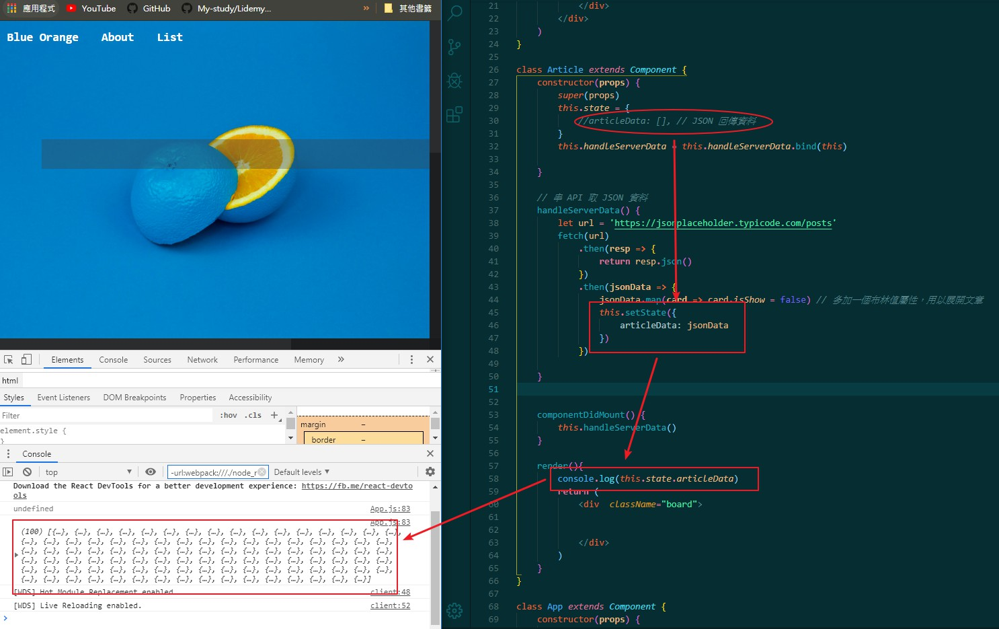
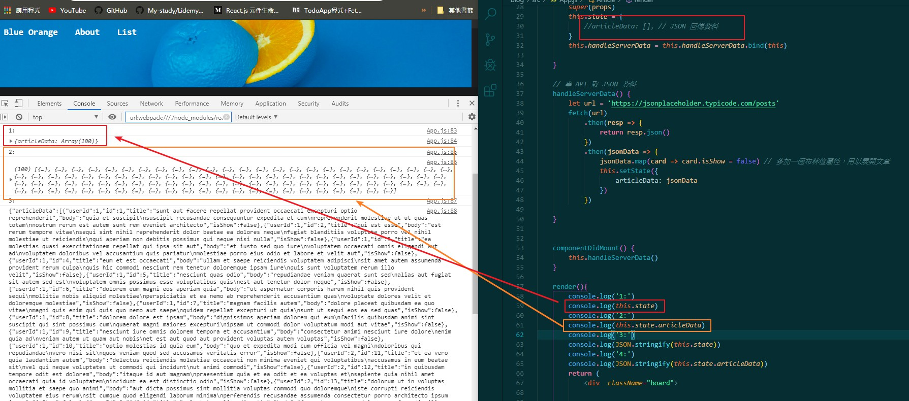
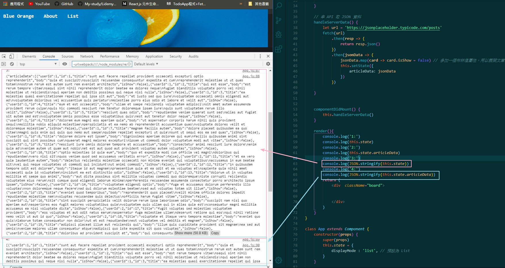
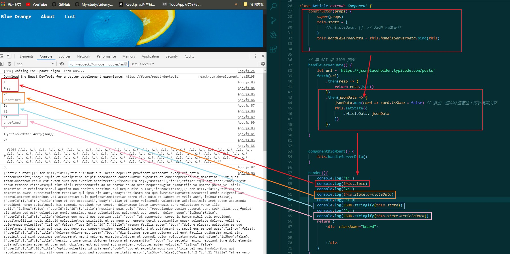
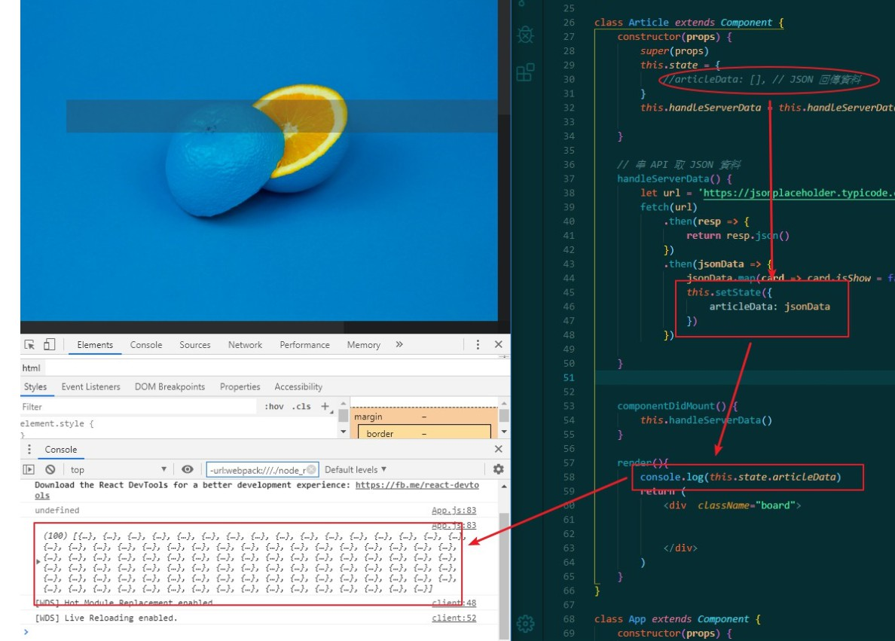
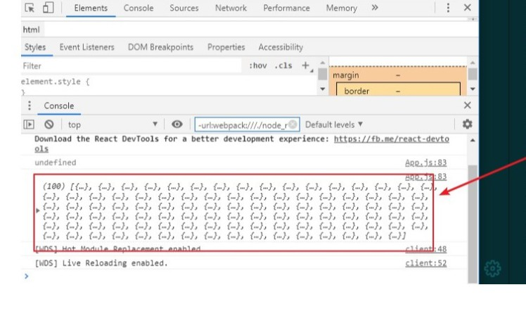
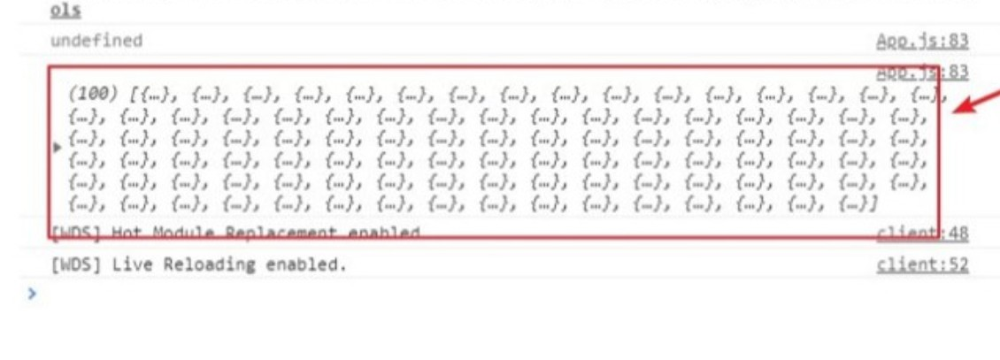
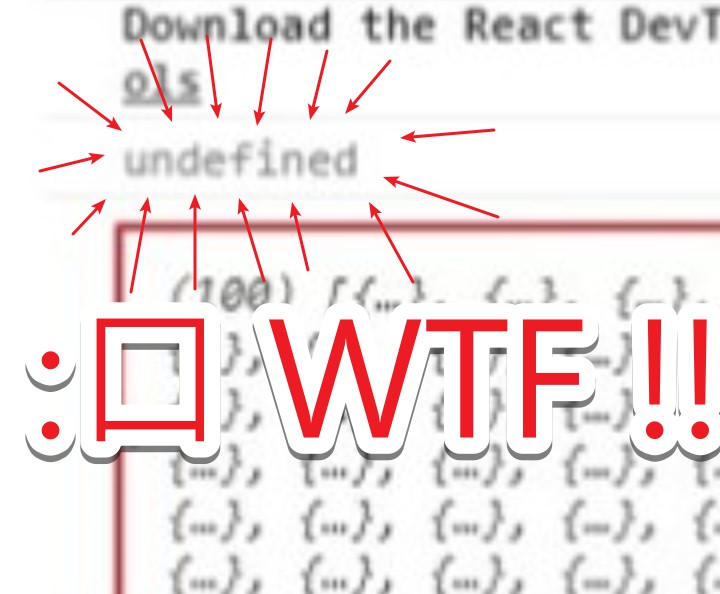

# 簡介

這是一個 Blog，目前的版本是用來串老師給的簡單 API

作法是讓 NAV BAR 決定要顯示何種內容，背景圖片是取用自 [Unsplash](https://unsplash.com)

作為一個練習 React 基礎用的作業，目前這樣做的難度並不高，一樣是很基礎的 React 概念

串 API 的部分使用 fetch，不另外引入 jQuery

讀取單篇文章的部分，原本的想法是發 Request 至 `https://jsonplaceholder.typicode.com/posts?id=1`

但後面覺得直接點選標題展開就好，所以沒有這樣做，或許之後會做修改

整份作業花我最多時間的部分反而是 `jsonData.map(card => card.isShow = false`，是很基礎的幫物件加上新元素，

卻因為這部分基礎忘記了所以花很久時間，大概就是這樣

-----

# 對於 state 的誤解


2019/09/07 我發了一篇心得，剛剛突然看到老師 Slack 有傳達對這份心得的糾正，感謝老師關心 XD

不過既然老師都願意花時間關心了，那麼這邊就來驗證一下老師提供的資訊

心得 + 老師原文如下 :

## 原文

-----

在寫 week21 hw3 串 API 拿 JSON 發現一個有趣的部分

```javascript
handleServerData() {
        let url = 'https://jsonplaceholder.typicode.com/posts'
        fetch(url)
            .then(resp => {
                return resp.json()
            })
            .then(jsonData => {
                 this.setState({
                        articleData: jsonData
                 })
            })
    }
```

這邊直接用 setState 設定 articleData ，重點是，我原先的 this.state 沒有初始化 articleData ，是在 setState 才加上去的

後續 `console.log(articleData)` 是有東西的，的確是一個 JSON 返還的 Array，但要調用時就有問題了 `( console.log(this.state.articleData[0] )`，會無法調用，並顯示

```javascript
Cannot read property “0” from undefined
```

印出 this.state 來看，也的確真的有 articleData，是 Array，但卻無法調用，這時候只要乖乖在 `this.state = { articleData : [] }` 就  OK 了 !

所以這個坑想表達的是，setState 僅供改變已經初始化的 state 物件的值使用，若原先沒有初始化，即使 state 中還是會存在你所賦予的值，但還是無法調用的

所以以後還是乖乖初始化囉　QQ

## 老師提點

-----

Huli: 「你的那個問題：」

>印出 this.state 來看，也的確真的有 articleData，是 Array，但卻無法調用，這時候只要乖乖在 this.state = { articleData : [] } 就  OK 了 !

Huli: 「我覺得不一定，」

Huli: 「因為 chrome devtool 有個知名的小 bug，」

Huli: 「你印出的內容有可能會變，」

Huli: 「意思是說，你印出 this.state 的時候確實沒內容，」

Huli: 「但是當你看 console 的時候， this.state 已經改變了，所以就會顯示改變後的內容，」

Huli: 「你可以試試看不要印 `this.state`，你印 `JSON.stringify(this.state)` 看看，」

Huli: 「或是 `JSON.stringify(this.state.articleData)`，」

Huli: 「看看是不是 `undefined`，」

Huli: 「我猜是，」

Huli: 「所以我猜你那問題的起因是因為你用到 `this.state.articleData[0]` 的時候，`articleDate` 是 `undefined`，」

Huli: 「所以才會出錯。」

>「setState 僅供改變已經初始化的 state 物件的值使用，若原先沒有初始化，即使 state 中還是會存在你所賦予的值，但還是無法調用的」

Huli: 「沒有這種事。」

## 實驗

-----

首先我們重現原本的場景，在 this.state 沒有初始化的情況下於 setState 修改這個 state 的值，並印出它



接著，遵照老師的作法：將 `console.log(this.state.articleData)` 改成`console.log(JSON.stringify(this.state))`與
`console.log(JSON.stringify(this.state.articleData))`

來看看結果 :

 `console.log(this.state)` 與 `console.log(this.state.articleData)` 




`console.log(JSON.stringify(this.state))` 與 `console.log(JSON.stringify(this.state.articleData))`




等等，怎麼還是一堆東西資料？這時候，我發現有點怪怪的... 把滾軸拉上去看，才發現




真的耶 ! 是 `undefined` 沒錯，而 1 與 3 會顯示 `{}` 則是因為 `this.state = {}`，

這時候我們來看上面**最一開始那一張圖** :







# **來，跟著老師唸一遍：U、N、D、E、F、I、N、E、D......**

好啦，看來真的是 chrome devtool 的問題

它顯示的是你改變後的內容，但實際上的確是沒有內容的，我的理解是錯誤的

這邊嘗試去找資料，但沒有找到相關的文章，我搜尋功力不太行啊

但這個經驗告訴我使用開發人員工具時，還是得好好看電腦給你的訊息

沒想到 Week1 的粗心拖到 Week21 還是有，的確不可不慎

最後謝謝老師的用心，感謝 !


