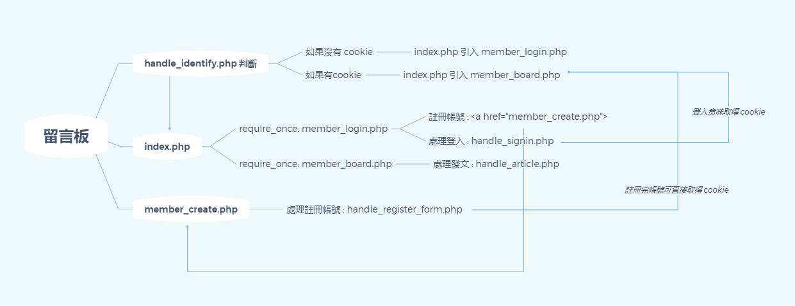

資料庫名稱：mtr03group5

- table name : claygao_users

| 欄位名稱 | 欄位型態 | 說明 |
|----------|----------|------|
|  id_number  |  varchar(16)   | 帳號名稱    |
| password |  varchar(16) | 帳號密碼 |
| password2 |  varchar(16) | 第二次輸入之帳號密碼 |
| username |  varchar(64) | 使用者名稱 |

 - table name : claygao_comments

 | 欄位名稱 | 欄位型態 | 說明 |
|----------|----------|------|
|  id |  int(10)   | 紀錄第 n 則留言    |
| title |  text | 留言文章標題 |
| content |  text | 留言文章內容 |
| name |  varchar(64) | 當下留言者名稱，這邊會取用目前登入者的 username |
| created_at | datetime[CURRENT_TIMESTAMP] | 創建時間，取發送請求時當下的時間 |

- hw2 結構

